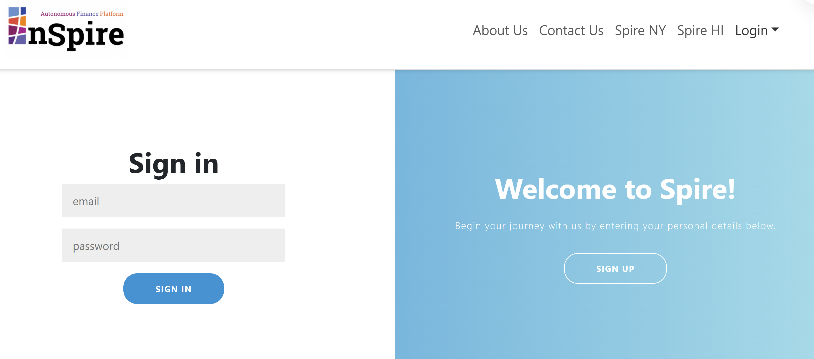
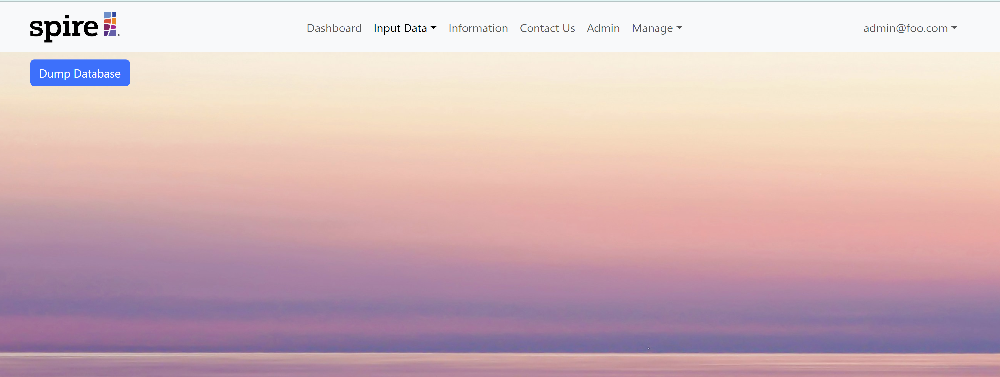

## Manoa Inspire

## Table of contents
- [About Us](#about-us)
- [Overview](#overview)
- [Approach](#approach)
- [User Guide](#user-guide)
- [Developer Guide](#developer-guide)
- [Deployment](#deployment)
- [Project Milestones](#project-milestones)

## About Us

### [View our Team Contract](https://docs.google.com/document/d/1EKSMDa4ylR5LYyZbSOVsgKpd4F_bSQixHQfj_jxeNWQ/edit?usp=sharing)

Manoa Inspire is made possible by: Tanner Berry, Roma Malasarte, Catelyn Jochim, Cash Baker, Blake Watanabe, Sydnee You, Luis Hernandez and Juncell Venzon-Abatayo.


## Overview

## User Guide

### Landing Page


### Login Page


### Dashboard
Here is the snapshot part of the dashboard:
<br>

<br>
Here is the 4 year charts (8 and 12 years have a similar outline):
<br>


### Input Data Pages

#### Audited Balance Page


#### Budget P&L Page


#### Audited Page


### User Page


### CSV File Page

### Contact Us Page


### Manage Page (Admin Login Only)



## Approach

## Developer Guide

### Installation
First, [install Meteor](https://www.meteor.com/).

Second, visit the [Manoa Inspire Repository Page](https://github.com/manoa-inspire/MATP), and click the "Clone" button to clone your own repository initialized with a copy of this application. Alternatively, you can download the sources as a zip file or make a fork of the repo.  However you do it, download a copy of the repo to your local computer.

Third, cd into the MATP/app directory and install libraries with:

```
$ meteor npm install
```

Fourth, run the system with:

```
$ meteor npm run start
```

If all goes well, the application will appear at [http://localhost:3000](http://localhost:3000).


### ESLint

Manoa Inspire includes an [.eslintrc](https://github.com/manoa-inspire/MATP/blob/main/app/.eslintrc.js) file to define the coding style adhered to in this application. You can invoke ESLint from the command line as follows:

```
meteor npm run lint
```

Here is sample output indicating that no ESLint errors were detected:

```
$ meteor npm run lint

> UH-Broadcast@ lint C:\Users\HRLia\Documents\GitHub\BroadcastHosting\app
> eslint --quiet --ext .jsx --ext .js ./imports && eslint --quiet --ext .js ./tests

$
```

ESLint should run without generating any errors.

It's significantly easier to do development with ESLint integrated directly into your IDE (such as IntelliJ).


## Deployment

## Project Milestones
[Milestone 1](https://github.com/orgs/manoa-inspire/projects/2/views/1) 
<br>
[Milestone 2](https://github.com/orgs/manoa-inspire/projects/9/views/1)
<br>
[Milestone 3](https://github.com/orgs/manoa-inspire/projects/10/views/1)
<br>
[Milestone 4](https://github.com/orgs/manoa-inspire/projects/14)
<br>
[Milestone 5](https://github.com/orgs/manoa-inspire/projects/15/views/1)
<br>
[Milestone 6](https://github.com/orgs/manoa-inspire/projects/16)


