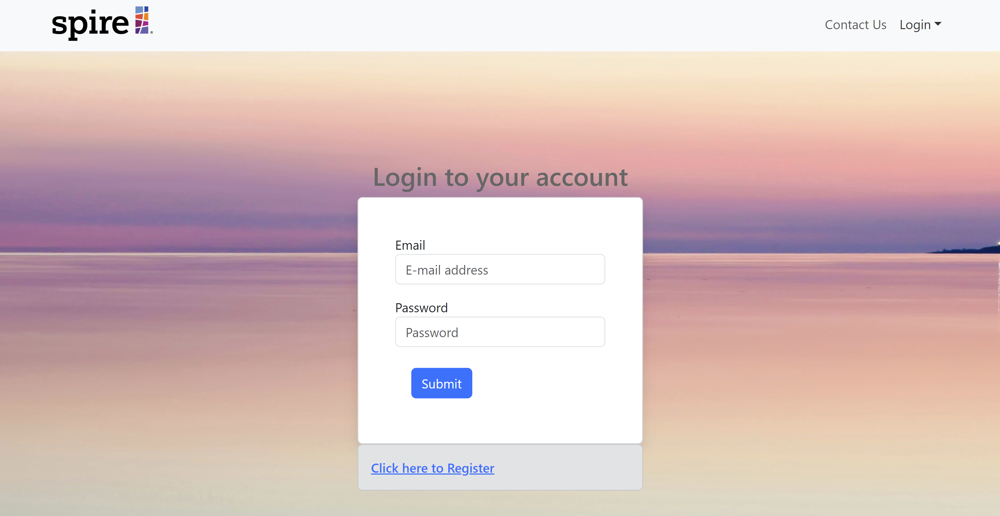

## Manoa Inspire

## Table of contents
- [About Us](#about-us)
- [Overview](#overview)
- [Approach](#approach)
- [User Guide](#user-guide)
- [Developer Guide](#developer-guide)
- [Deployment](#deployment)
- [Project Milestones](#project-milestones)

## About Us

### [View our Team Contract](https://docs.google.com/document/d/1EKSMDa4ylR5LYyZbSOVsgKpd4F_bSQixHQfj_jxeNWQ/edit?usp=sharing)

Manoa Inspire is made possible by: Tanner Berry, Roma Malasarte, Catelyn Jochim, Cash Baker, Blake Watanabe, Sydnee You, Luis Hernandez and Juncell Venzon-Abatayo.

## Overview

### Landing Page

### Login Page

### Dashboard
Here is the snapshot part of the dashboard:
 

 
Here is the 4 year charts (8 and 12 years have a similar outline):
 

### Input Data Pages

#### Audited Balance Page

#### Budget P&L Page

#### Audited Page

### Information Page

### Contact Us Page

### Manage Page (Admin Login Only)

## Approach

## User Guide

## Developer Guide

## Deployment

## Project Milestones
[Milestone 1](https://github.com/orgs/manoa-inspire/projects/2/views/1)
[Milestone 2](https://github.com/orgs/manoa-inspire/projects/9/views/1)

